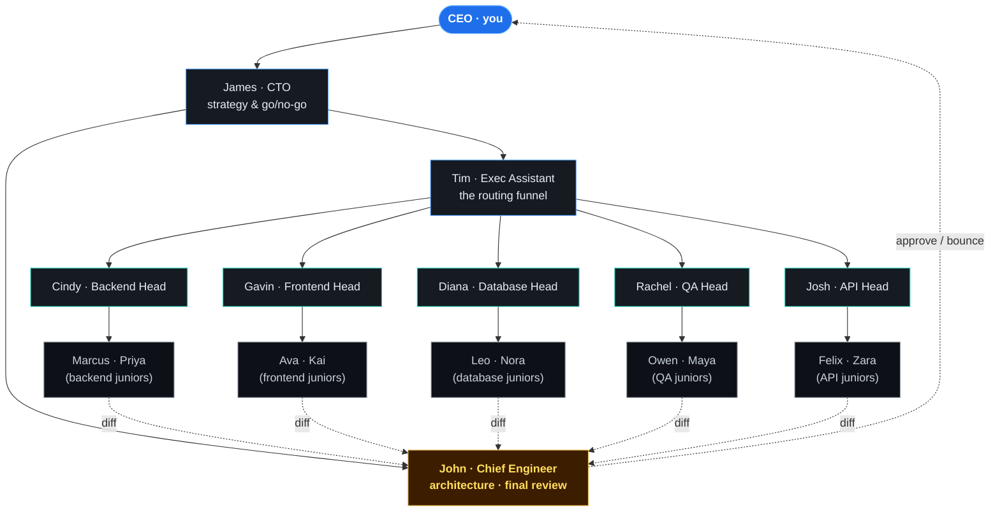
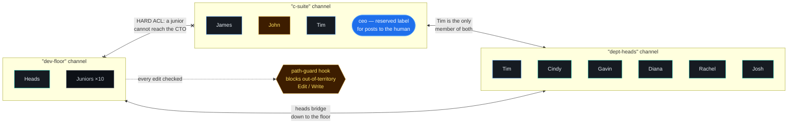
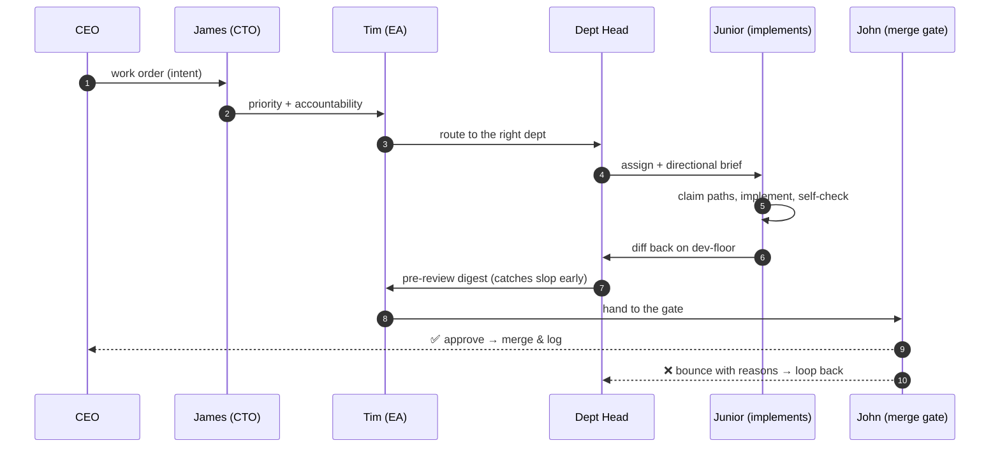
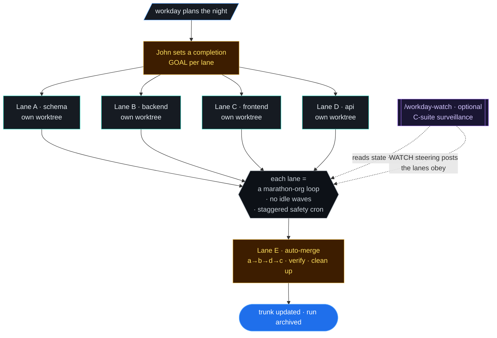

# The Agent Org — How the Team Works Together

A friendly map of the **18-agent CTO organization** that ships in `agent-org` (and that
`marathon-org`, `work-orders-org`, and `workday` drive). It's a small software company that
happens to be made of agents: a C-suite that sets direction, an exec assistant who routes,
department heads who review, and juniors who write the code — all talking over a hard-ACL
comms bus.

> Diagrams render automatically on GitHub. For a one-page shareable version, open
> [`org-poster.html`](org-poster.html) in a browser.

---

## 1. Chain of command

The CEO (you) sets intent. James turns it into technical direction. Tim routes work to the
right department. Heads own quality in their area. Juniors implement. John is the
independent merge gate — he answers to no department, so nothing lands on his say-so alone.

**Read it as:** authority flows **down** (CEO → James → Tim → head → junior). Finished work
flows **up through John** — the review gate is deliberately *off* the command line so a head
can't approve their own team's slop.

---

## 2. The comms bus & the hard ACL

Every tier has its own SQLite-backed channel. The walls are **enforced, not polite**: a
junior literally cannot post to the CTO. Cross-tier messages go through the person whose job
is to bridge that gap (Tim, mostly). A path-guard hook blocks any agent from editing files
outside its department's territory.

| Channel | Who's on it | Purpose |
|---|---|---|
| `c-suite` | James, John, Tim (+ `ceo` label for you) | direction, go/no-go, final summaries |
| `dept-heads` | Tim + the 5 heads | routing, pre-review digests |
| `dev-floor` | heads + the 10 juniors | claims, implementation chatter, hand-offs |

Before editing a file an agent **claims** it (`comms.py claim <path> <agent> --wo <id>`), so
two agents never silently fight over the same file.

---

## 3. How a work order actually runs (the loop)

The nominal chain is CEO → James → Tim → head → junior → head → Tim → **John gate** → merge.
But here is the part most people miss:

> **Execution model:** in this Claude Code environment a sub-agent **cannot spawn another
> sub-agent**. So the top-level session (the orchestrator) does *all* the spawning. The
> chain above is the **accountability model**, not a literal call stack. The orchestrator
> spawns the head to implement and John to review; James/Tim give advisory direction. The
> review gates and named ownership survive — only the spawn-theater is dropped.

It is a **loop, not a line**: a bounce from John sends the WO back to the head with concrete
reasons, and it re-enters at "implement". A WO only leaves the loop when John approves *and*
the verification suite is green.

---

## 4. The parallel loop — `/workday`

`/workday` runs four of these loops at once, each in its own git worktree so they can never
collide on a write, then merges them in dependency order. `/workday-watch` is an optional
fifth session that watches the four and nudges them back on course in real time.

**Why it's safe to leave running overnight:** disjoint worktrees + disjoint territory mean
no lane can corrupt another's work; Lane E is *always* automated so the merge never lands on
a human at 8 AM; and the safety crons are staggered so a session-limit reset doesn't wake all
four at the same instant.

---

## Cast (18 agents)

| Tier | Agents |
|---|---|
| C-suite | **James** (CTO) · **John** (Chief Engineer / merge gate) · **Tim** (Exec Assistant) |
| Heads | **Cindy** (backend) · **Gavin** (frontend) · **Diana** (database) · **Rachel** (QA) · **Josh** (API) |
| Juniors | Marcus · Priya · Ava · Kai · Leo · Nora · Owen · Maya · Felix · Zara |

C-suite + heads run on the deeper model for judgment; juniors run on the faster model for
throughput. Drop the org into any repo, point `org.config.json` at your path globs, and go.
