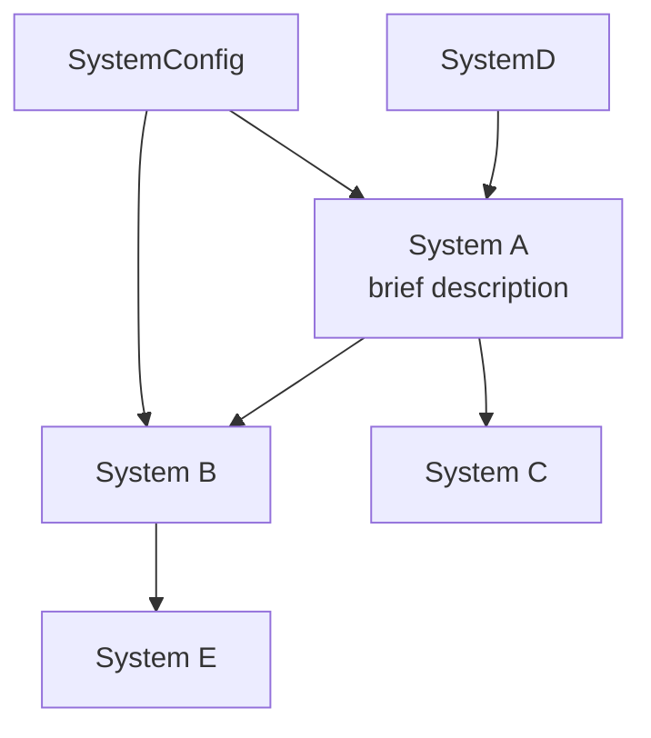

# Systems Map Skill

## Purpose

Most non-trivial codebases have multiple interlocking systems. When one changes, ripple effects hit others: changing a rate or constant affects pacing in another module, which affects a downstream calculation, which affects a user-facing value. Without a dependency map, it is easy to make a tuning change that unintentionally breaks something downstream.

This skill reads your source path to enumerate every system, extracts data flows and dependencies, and produces a Mermaid diagram plus a dependency matrix.

## Configure for your project

Edit these placeholders before running:

- `<core-path>`: directory containing the system modules to map (e.g. `src/core/`, `packages/core/src/`, `lib/`).
- `<systems-output-path>`: where to write the generated map (e.g. `docs/systems/systems-map.md`).
- `<known-systems>`: optional list of expected systems with their primary file. The skill will still infer from code, but a hint list improves accuracy.

## Invocation

```
/systems-map                    -- full refresh from current code
/systems-map --focus <name>     -- show only systems connected to <name>
/systems-map --dry-run          -- do not write files, just print report
```

## Prerequisites

- File read access to `<core-path>`
- Write access to `<systems-output-path>`

## Workflow

### Step 1: Enumerate Systems

Scan `<core-path>` for every module that defines a system. A "system" is any module that exposes constants, formulas, or rules that other modules consume. Cross-reference against `<known-systems>` if provided.

For each system, extract:
- Primary data (what values it defines / computes)
- Inputs (what other systems feed it)
- Outputs (what downstream systems consume its values)
- Hard-coded constants vs configurable values

### Step 2: Build Dependency Matrix

For every pair (A, B), determine:
- **A depends on B** (A reads B's values)
- **B depends on A** (B reads A's values)
- **Bidirectional** (both)
- **Independent** (no direct relationship)

Output as a matrix:

```
| From \ To  | A  | B  | C  | D  | E  | F  |
|------------|----|----|----|----|----|----|
| A          | -  | D  |    | R  |    | D  |
| B          |    | -  | D  |    |    |    |
| C          |    |    | -  |    | B  |    |
...
```

Legend: D = downstream depends on From, R = From reads To, B = bidirectional

### Step 3: Generate Mermaid Diagram

Produce a directed graph in Mermaid format:



### Step 4: Identify High-Risk Systems

Flag systems that are:
- **High fan-out**: many systems depend on them (changing them breaks many things).
- **Circular dependencies**: A -> B -> A. Should be rare; flag any found and show the cycle path.
- **Hidden coupling**: systems that share a constant or computation without clear ownership.
- **Underspecified**: systems where dependencies cannot be determined from code (likely has runtime / config dependencies).

### Step 5: Produce Report

Save to `<systems-output-path>`:

```markdown
# Systems Map

Generated: [date]
Source: <core-path>

## Systems Inventory
[N systems with one-line descriptions]

## Dependency Matrix
[full table]

## Mermaid Diagram
[the graph]

## High-Risk Systems
### [System Name] (high fan-out)
Changing X affects: [list of downstream systems]
Recommendation: Any tuning here should be followed by a full regression check.

## Circular Dependencies
[any found, or "none"]

## Suggested Tuning Sequence
When tuning multiple systems, recommended order:
1. [most upstream system]
2. [next]
3. [...]

## Open Questions
[any systems that could not be fully mapped — flag for human review]
```

### Step 6: Follow-Up Actions

Recommend:
- Run any cross-system balance / regression checks if multiple systems need re-tuning
- Review flagged circular dependencies
- Update spec docs if this map reveals systems documented there that no longer exist in code

## Principles

- **Upstream systems first.** When making tuning changes, start with the most upstream system to avoid cascading re-tunings.
- **Map is evidence, not truth.** Code-derived maps can miss runtime config dependencies, environment-driven behavior, and cross-module state. Flag uncertainty explicitly.
- **Focus mode is cheap.** `--focus` mode is the usual invocation. Full map is for periodic review.

## Anti-Patterns

- Do not hand-curate the map from memory. Always regenerate from code.
- Do not delete systems from the map without confirming they were actually removed from code.
- Do not claim "circular dependencies found" without showing the cycle path.
